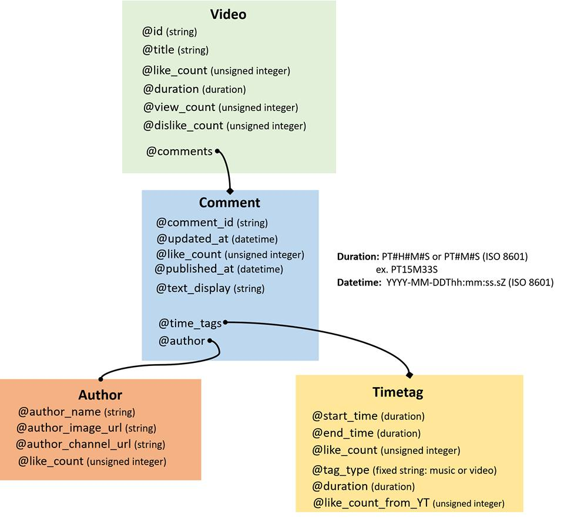

# YPBT Web API

API to access the information of comments following a given movie, such as author name, comment content, and author channel url.

# YTBT-API doc  
- `version`    : v0.1  
- `video_id`   : YouTube video id  
- `comment_id` : YouTube comment id  
- `time_tag_id`: YTBT-API time tag id  

## Video  
* <strong>Get</strong> /api/{version}/Video/{video_id}  
> *Discription:* return a basic information of target video directly from YouTube API  
> *Return:*  
<table>
<tr><td><strong>Field</strong></td><td><strong>Type</strong></td></tr>
<tr><td>video_id</td><td>string</td></tr>
<tr><td>title</td><td>string</td></tr>
<tr><td>description</td><td>string</td></tr>
<tr><td>view_count</td><td>int</td></tr>
<tr><td>like_count</td><td>int</td></tr>
<tr><td>dislike_count</td><td>int</td></tr>
<tr><td>duration</td><td>ISO 8601</td></tr>
<tr><td>channel_id</td><td>string</td></tr>
<tr><td>channel_title</td><td>string</td></tr>
<tr><td>channel_image_url</td><td>url</td></tr>
<tr><td>channel_description</td><td>string</td></tr>
</table>

* <strong>Get</strong> /api/{version}/Videos
> *Discription:* return information of all storaged videos
> *Return:*  array of <strong>videos info</strong>
> <strong>videos info=</strong>
<table>
<tr><td><strong>Field</strong></td><td><strong>Type</strong></td></tr>
<tr><td>video_id</td><td>string</td></tr>
<tr><td>title</td><td>string</td></tr>
<tr><td>description</td><td>string</td></tr>
<tr><td>view_count</td><td>int</td></tr>
<tr><td>like_count</td><td>int</td></tr>
<tr><td>dislike_count</td><td>int</td></tr>
<tr><td>duration</td><td>ISO 8601</td></tr>
<tr><td>channel_id</td><td>string</td></tr>
<tr><td>channel_title</td><td>string</td></tr>
<tr><td>channel_image_url</td><td>url</td></tr>
<tr><td>channel_description</td><td>string</td></tr>
</table>

## Comment
* <strong>Get</strong> /api/{version}/Comment/{comment_id}  
> *Discription:* return the detail information of targeted comment  
> *Return:*  
<table>
<tr><td><strong>Field</strong></td><td><strong>Type</strong></td></tr>
<tr><td>video_id</td><td>string</td></tr>
<tr><td>comment_id</td><td>string</td></tr>
<tr><td>text_display</td><td>string</td></tr>
<tr><td>like_count</td><td>int</td></tr>
<tr><td>author_name</td><td>string</td></tr>
<tr><td>author_image_url</td><td>url</td></tr>
<tr><td>author_channel_url</td><td>url</td></tr>
</table>

* <strong>Get</strong> /api/{version}/Comments/{video_id}  
> *Discription:* return the detail information of comments  
> *Return:* array of <strong>comment data</strong>  
> <strong>comment data=</strong>
<table>
<tr><td><strong>Field</strong></td><td><strong>Type</strong></td></tr>
<tr><td>video_id</td><td>string</td></tr>
<tr><td>comment_id</td><td>string</td></tr>
<tr><td>text_display</td><td>string</td></tr>
<tr><td>like_count</td><td>int</td></tr>
<tr><td>author_name</td><td>string</td></tr>
<tr><td>author_image_url</td><td>url</td></tr>
<tr><td>author_channel_url</td><td>url</td></tr>
</table>
> *Additional effects:* update database records for `video_id`

## Time Tag
* <strong>Get</strong> /api/{version}/TimeTags/{video_id}  
> *Discription:* return raw data of time tags that belong to the target video  
> *Return:*  array of <strong>time tags info</strong>  
> <strong>time tags info=</strong>
<table>
<tr><td><strong>Field</strong></td><td><strong>Type</strong></td></tr>
<tr><td>time_tag_id</td><td>string</td></tr>
<tr><td>start_time</td><td>string</td></tr>
<tr><td>end_time</td><td>string</td></tr>
<tr><td>tag_type</td><td>string</td></tr>
<tr><td>start_time_percentage</td><td>float</td></tr>
<tr><td>end_time_percentage</td><td>float</td></tr>
</table>
> *Additional effects:* update database records for `video_id`

* <strong>Get</strong> /api/{version}/TimeTag/{time_tag_id}
> *Discription:* return detail data of target time tag  
> *Return:*  
<table>
<tr><td><strong>Field</strong></td><td><strong>Type</strong></td></tr>
<tr><td>time_tag_id</td><td>string</td></tr>
<tr><td>start_time</td><td>string</td></tr>
<tr><td>end_time</td><td>string</td></tr>
<tr><td>like_count</td><td>int</td></tr>
<tr><td>unlike_count</td><td>int</td></tr>
<tr><td>tag_type</td><td>string</td></tr>
<tr><td>comment_text_display</td><td>string</td></tr>
<tr><td>comment_author_name</td><td>string</td></tr>
<tr><td>comment_author_image_url</td><td>url</td></tr>
<tr><td>comment_author_channel_url</td><td>url</td></tr>
</table>  

* <strong>Post</strong> /api/{version}/TimeTag/
> *Discription:* add new TimeTag    
> *Parameter:*
<table>
<tr><td><strong>Field</strong></td><td><strong>Type</strong></td></tr>
<tr><td>video_id</td><td>string</td></tr>
<tr><td>start_time</td><td>string</td></tr>
<tr><td>end_time (optional)</td><td>string</td></tr>
<tr><td>tag_type</td><td>string</td></tr>
<tr><td>comment_text_display</td><td>string</td></tr>
<tr><td>api_key</td><td>string</td></tr>
</table>

* <strong>Put</strong> /api/{version}/TimeTag/add_one_like
> *Discription:* add like count for the tag  
> *Parameter:*
<table>
<tr><td><strong>Field</strong></td><td><strong>Type</strong></td></tr>
<tr><td>time_tag_id</td><td>string</td></tr>
<tr><td>api_key</td><td>string</td></tr>
</table>

* <strong>Put</strong> /api/{version}/TimeTag/add_one_unlike
> *Discription:* add unlike count for the tag
> *Parameter:*
<table>
<tr><td><strong>Field</strong></td><td><strong>Type</strong></td></tr>
<tr><td>time_tag_id</td><td>string</td></tr>
<tr><td>api_key</td><td>string</td></tr>
</table>

##  
* <strong>Database Model</strong> (primitive)  
  

